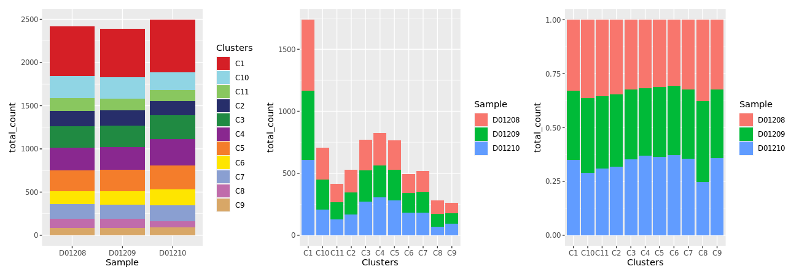
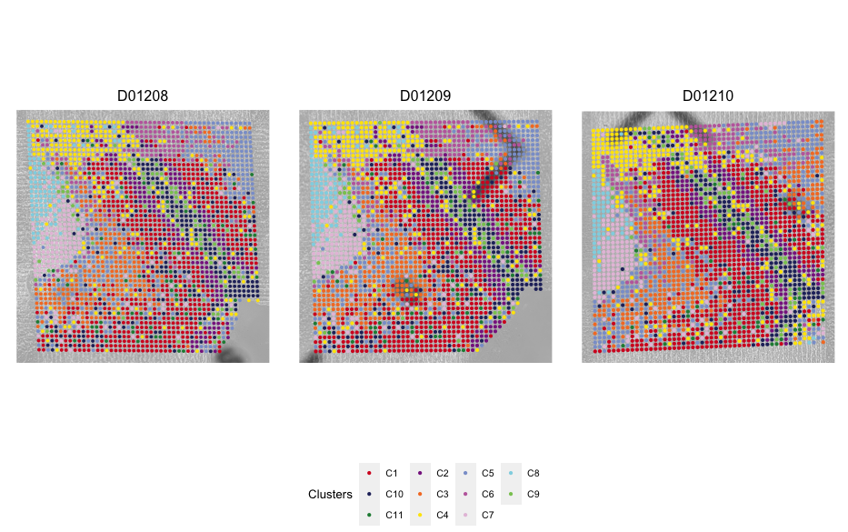
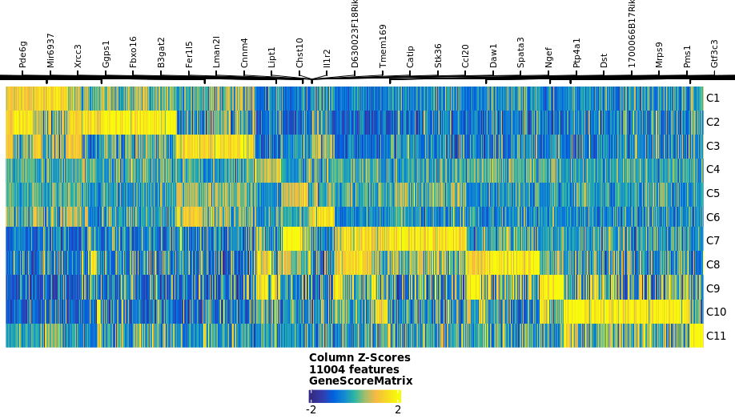
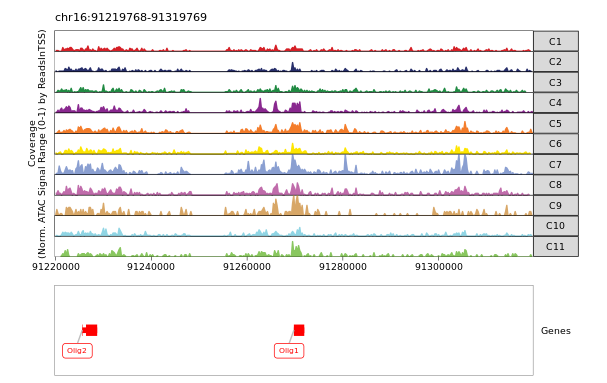
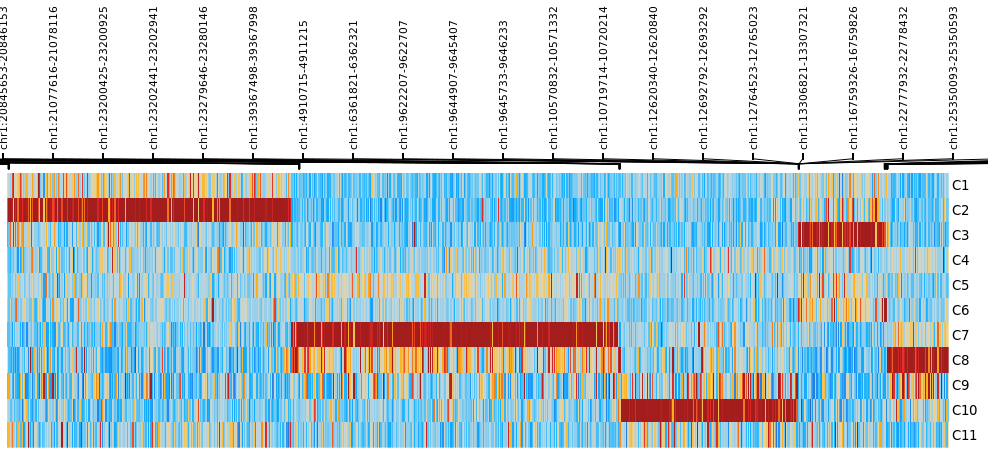

# Tutorial: Spatial-CUT&Tag via DBiT-seq

This tutorial provides a brief introduction to epigenomic analysis of
experiments performed via Deterministic Barcoding in Tissue for Spatial
Omics Sequencing (DBiT-seq). We use the
[ArchR](https://www.archrproject.com/) and
[Seurat](https://satijalab.org/seurat/) packages to create a spatially
resolved analysis object in which epigenetic information is mapped to
the tissue histology. This analysis follows standard scATAC downstream
analysis as outlined in the
[ArchR](https://www.archrproject.com/bookdown/getting-started-with-archr.html)
and [Seurat](https://satijalab.org/seurat/articles/pbmc3k_tutorial)
tutorials.

Here we present the analysis of a [spatial
CUT&Tag](https://www.science.org/doi/10.1126/science.abg7216) experiment
with triplicate mouse brain sections. The sections were profiled with an
antibody against **H3K27ac** (activating enhancers and/or promoters). We
demonstrate:

-   Creation of ArchR analysis objects and basic QC
-   Dimensionality reduction and clustering
-   Creation of spatial SeuratObjects and spatial QC
-   Differential gene regulation
-   Peak calling and motif annotation
-   Spatial analysis of genes and motifs
-   Cell typing with spatial mapping

```{r message=FALSE}

library(ArchR)
library(dplyr)
library(ggpubr)
library(grid)
library(gridExtra)
library(harmony)
library(hdf5r)
library(knitr)
library(Matrix)
library(patchwork)
library(pheatmap)
library(purrr)
library(rmarkdown)
library(Seurat)

source("utils.R")

```

## Setup environment, set global variables

```{r message=FALSE}

setwd("~/")

addArchRThreads(threads = 16) 
addArchRGenome("mm10") # mouse=mm10, human=hg38

run_ids <- c(
  "D01208",
  "D01209",
  "D01210"
)

fragment_paths <- c(
  "fragments/cleaned_D01208_NG02241_fragments.tsv.gz",
  "fragments/cleaned_D01209_NG02242_fragments.tsv.gz",
  "fragments/cleaned_D01210_NG02243_fragments.tsv.gz"
)

spatial_dirs <- c(
  "spatials/D1208/spatial/",
  "spatials/D1209/spatial/",
  "spatials/D1210/spatial/"
)

position_files <- c(
  "spatials/D1208/spatial/tissue_positions_list.csv",
  "spatials/D1209/spatial/tissue_positions_list.csv",
  "spatials/D1210/spatial/tissue_positions_list.csv"
)

```

## ArchR Project generation

### Generate Arrow Files from fragment files

With a fragments.tsv file outputted from a single-cell ATAC-seq
preprocessing and alignment workflow, we can create ArchR Arrow Files.
This will form the basis of our ATAC analysis. During the Arrow File
creation step, all of the necessary data and metadata for the given
sample will be generated and stored on disk in HD5 format. A few
parameters such as minTSS and minFrags can be passed to filter out any
poor quality tixels from the dataset.

```{r message=FALSE, warning=FALSE}

inputs <- c()
for (i in seq_along(run_ids)) {
  inputs[run_ids[i]] <- fragment_paths[i]
}

ArrowFiles <- createArrowFiles(
  inputFiles = inputs,
  sampleNames = names(inputs),
  minTSS = 2,
  minFrags = 0,
  maxFrags = 1e+07,
  addTileMat = TRUE,
  addGeneScoreMat = TRUE,
  offsetPlus = 0,
  offsetMinus = 0,
  force = TRUE,
  TileMatParams = list(tileSize = 5000)
)

```

### Create ArchRProject

ArchR accesses data by associating the newly created ArrowFiles with an
**ArchRProject**. All of the ArchR downstream analysis will take place
on the ArchRProject. To create an ArchRProject, pass in the previously
created ArrowFiles object to the ArchRProject function call.

```{r message=FALSE}

proj <- ArchRProject(
  ArrowFiles = ArrowFiles, 
  outputDirectory = "ArchRProject"
)

```

### Filter "off-tissue" tixels

The tissue_positions.csv file generated via
[AtlasXBrowser](https://docs.atlasxomics.com/projects/AtlasXbrowser/en/latest/Overview.html)
is used to remove 'off-tissue' tixels from analysis.

```{r}

all_ontissue <- c()
for (i in seq_along(position_files)) {
  positions <- read.csv(position_files[i], header = FALSE)
  positions$V1 <- paste(run_ids[i], "#", positions$V1, "-1", sep = "")
  on_tissue <- positions$V1 [which(positions$V2 == 1)]
  all_ontissue <- c(all_ontissue, on_tissue)
}
proj <- proj[proj$cellNames %in% all_ontissue]

```

### QC plots

Plots of log10(unique nuclear fragments) vs TSS enrichment score and
fragment size distribution per sample can be found in the
"QualityControl" folder in working directory. Combined plots can also be
generated.

```{r}

plotTSSEnrichment(proj)
plotFragmentSizes(proj)

```


<br>

## Dimensionality reduction and clustering

Dimension reduction performed with ArchR LSI function; batch correction
performed with
[Harmony](https://www.archrproject.com/bookdown/batch-effect-correction-wtih-harmony.html).
Seurat's `FindClusters()` function is used for [graph
clustering](https://www.archrproject.com/bookdown/clustering-using-seurats-findclusters-function.html).

```{r message=FALSE}

proj <- addIterativeLSI(
  ArchRProj = proj,
  useMatrix = "TileMatrix", 
  name = "IterativeLSI", 
  iterations = 2, 
  clusterParams = list(
    resolution = c(0.5), 
    sampleCells = 10000, 
    n.start = 10
  ), 
  varFeatures = 50000, 
  dimsToUse = 1:30,
  force = TRUE
)

proj <- addHarmony(
  ArchRProj = proj,
  reducedDims = "IterativeLSI",
  name = "Harmony",
  groupBy = "Sample",
  force = TRUE
)

proj <- addClusters(
  input = proj,
  reducedDims = "Harmony",
  method = "Seurat",
  name = "Clusters",
  resolution = c(1.0),
  force = TRUE
)

proj <- addUMAP(
  ArchRProj = proj, 
  reducedDims = "Harmony", 
  name = "UMAP", 
  nNeighbors = 30, 
  minDist = 0.0, 
  metric = "cosine",
  force = TRUE
)

```
### Plot UMAP and cluster distribution

The UMAP can be visualized and colored by sample and clusters.

```{r}

# plot the UMAP, colored by sample
p1 <- plotEmbedding(
  ArchRProj = proj,
  colorBy = "cellColData",
  name = "Sample",
  embedding = "UMAP"
)

# plot the UMAP, colored by clusters
p2 <- plotEmbedding(
  ArchRProj = proj,
  colorBy = "cellColData",
  name = "Clusters",
  embedding = "UMAP"
)

p1 + p2

```


Plot cluster distribution by sample

```{r}

df1 <- as.data.frame(proj@cellColData)
n_clusters <- length(unique(proj$Clusters))
colors <- ArchRPalettes$stallion[as.character(seq_len(n_clusters))]
names(colors) <- paste0('C', seq_len(n_clusters))

df2 <- df1 %>% group_by(Sample, Clusters) %>%
  summarise(total_count=n(), .groups = "drop") %>%
  as.data.frame()

comp1 <- ggplot(df2, aes(fill = Clusters, y = total_count, x = Sample)) +
  geom_bar(position = "stack", stat = "identity") +
  scale_fill_manual(values = colors)

comp2 <- ggplot(df2, aes(fill = Sample, y = total_count, x = Clusters)) +
  geom_bar(position = "stack", stat = "identity")

comp3 <- ggplot(df2, aes(fill = Sample, y = total_count, x = Clusters)) +
  geom_bar(position = "fill", stat = "identity")

comp1 + comp2 + comp3

```



It's a good idea to frequently save your ArchRProject, especially after
running expensive computations.

```{r}

saveArchRProject(
  ArchRProj = proj,
  outputDirectory = "ArchRProject",
  load = FALSE
)

```

## SeuratObject visualization

### Build SeuratObjects

Create a metadata table for SeuratObject.

```{r}

metadata <- getCellColData(ArchRProj = proj)
rownames(metadata) <- str_split_fixed(
  str_split_fixed(
    row.names(metadata),
    "#",
    2)[, 2],
  "-",
  2)[, 1]
metadata["log10_nFrags"] <- log(metadata$nFrags)

```

Create a gene matrix for SeuratObject.

```{r}

proj <- addImputeWeights(proj, reducedDims = "Harmony")

gene_matrix <- getMatrixFromProject(
  ArchRProj = proj,
  useMatrix = "GeneScoreMatrix"
)
matrix <- imputeMatrix(
  mat = assay(gene_matrix),
  imputeWeights = getImputeWeights(proj)
)
rownames(matrix) <- gene_matrix@elementMetadata$name

```

Build SeuratObjects with `build_atlas_seurat_object()` from utils.R

```{r}

seurat_objs <- c()
for (i in seq_along(run_ids)) {

  obj <- build_atlas_seurat_object(
    run_id = run_ids[i],
    matrix = matrix,
    metadata = metadata,
    spatial_path = spatial_dirs[i]
  )
  seurat_objs <- c(seurat_objs, obj)
}

```

### Spatial cluster plots

Plot the clusters identities of each tixel overlaid on top of the tissue
image with `spatial_plot()` from utils.R; this functions call the Seurat
function
[SpatialDimPlot](https://satijalab.org/seurat/reference/spatialplot).

```{r}

spatial_cluster_plots = list()
for (i in seq_along(run_ids)){
  plot <- spatial_plot(seurat_objs[[i]], run_ids[i])
  spatial_cluster_plots[[i]] <- plot
}

final <- ggarrange(
  spatial_cluster_plots[[1]],
  spatial_cluster_plots[[2]],
  spatial_cluster_plots[[3]],
  ncol = 3,
  nrow = 1,
  common.legend = TRUE,
  legend = "bottom"
)

final

```



### Spatial QC plots

Plot qc metrics of each tixel overlaid on top of the tissue image with
`feature_plot()` from utils.R; this functions call the Seurat function
[SpatialFeaturePlot](https://satijalab.org/seurat/reference/spatialplot).
QC metrics to plot include:

-   TSSEnrichment
-   nFrags
-   log10_nFrags

```{r}

metric <- "log10_nFrags"

spatial_qc_plots <- list()
for (i in seq_along(run_ids)){
  plot <- feature_plot(seurat_objs[[i]], metric, run_ids[i])
  spatial_qc_plots[[i]] <- plot
}

spatial_qc_plots[[1]] + spatial_qc_plots[[2]] + spatial_qc_plots[[3]]

```


### Spatial genes plots

```{r}

gene <- "Opalin"

spatial_gene_plots <- list()
for (i in seq_along(run_ids)){
  plot <- feature_plot(seurat_objs[[i]], gene, run_ids[i])
  spatial_gene_plots[[i]] <- plot
}

spatial_gene_plots[[1]] + spatial_gene_plots[[2]] + spatial_gene_plots[[3]]

```

s

## Differential gene regulation

### Identify marker genes

Extract [gene
scores](https://www.archrproject.com/bookdown/gene-scores-and-marker-genes-with-archr.html)
and identify marker genes with thresholds **FDR \<= 0.05, Log2FC \>=
0.2**. `getMarkerFeatures()` returns a `SummarizedExperiment` object for
downstream analysis; `getMarkers()` converts the `SummarizedExperiment`
to a DataFrame that can be saved for later analysis.

```{r}

markersGS <- getMarkerFeatures(
  ArchRProj = proj,
  useMatrix = "GeneScoreMatrix",
  groupBy = "Clusters",
  bias = c("TSSEnrichment", "log10(nFrags)"),
  testMethod = "wilcoxon"
)

markerList <- getMarkers(markersGS, cutOff = "FDR <= 0.05 & Log2FC >= 0.2")
write.csv(markerList, file = "CnT_outs/markerList.csv", row.names = FALSE)

```

### Marker gene heatmaps

A heatmap of all marker genes by cluster can be plotted with
plotMarkerHeatmap.

```{r}

heatmapGS <- plotMarkerHeatmap(
  seMarker = markersGS,
  cutOff = "FDR <= 0.05 & Log2FC >= 0.2",
  transpose = TRUE
)

ComplexHeatmap::draw(
  heatmapGS,
  heatmap_legend_side = "bot",
  annotation_legend_side = "bot"
)

```



A subset of markers genes can be plotted as well.

```{r}

marker_genes_subset  <- c(
    "Tmem119", "Cx3cr1", "Itgam", # microglia
    "Slc1a2", "Gfap", # astrocytes
    "Mbp", "Opalin", "Mog", "Mobp", "Cspg4", "Cldn11", "Olig1", # oligodendrocytes
    "Nefh", "Syt1", "Rbfox3", # neurons
    "Slc17a7", # excitatory neuron
    "Gad1", # inhibitory neuron 
    "Pdgfrb", "Ng2", # pericyte
    "Prox1" # denate gyrus  
  )

subsetSE <- markersGS[which(rowData(markersGS)$name %in% marker_genes_subset), ]

heatmapGS_subset <- plotMarkerHeatmap(
  seMarker = subsetSE,
  cutOff = "FDR <= 0.05 & Log2FC >= 0.2",
  transpose = TRUE
)

heatmap(
  as.matrix(heatmapGS_subset@matrix),
  scale = "column",
  col = viridis::viridis(50)
)

```


### Genome tracks of marker genes

Local chromatin accessablity can be plotted against [genome browser
tracks](https://www.archrproject.com/bookdown/track-plotting-with-archrbrowser.html).
Here, we plot all genes in `marker_genes_subset` and save them as PDF in
the ArchRProject/Plots directory.

```{r}

tracks <- plotBrowserTrack(
  ArchRProj = proj, 
  groupBy = "Clusters",
  geneSymbol = marker_genes_subset,
  upstream = 50000,
  downstream = 50000
)

# save tracks to pdf
plotPDF(
  tracks, 
  ArchRProj = proj,
  length = 6,
  name = "Gene_Tracks",
  addDOC = FALSE
)

```

`grid` can be used to plot specific genes from the list.

```{r}

grid::grid.newpage()
grid::grid.draw(tracks$Olig1)

```



Save your project.

```{r}
saveArchRProject(
  ArchRProj = proj,
  outputDirectory = "ArchRProject",
  load = FALSE
)

```

## Peak Calling

[Pseudo-bulk
replicates](https://www.archrproject.com/bookdown/making-pseudo-bulk-replicates.html)
must be created for our clusters before peak calling can be performed;
they are added to the ArchRProject with the `addGroupCoverages()`
function. [Peak
calling](https://www.archrproject.com/bookdown/calling-peaks-w-macs2.html)
is performed with MACS2; specifically, we have found **MACS2 v-2.2.6**
to be compatible with ArchR. The function `findMacs2()` can be used to
find the path to your MACS2 instillation.

```{r}

proj <- addImputeWeights(proj)

proj <-addGroupCoverages(
  ArchRProj = proj,
  groupBy = "Clusters",
  force = TRUE
)

# Set to local macs2 installation
pathToMacs2 <- "/opt/mamba/envs/jupyterlab/bin/macs2"

proj <- addReproduciblePeakSet(
  ArchRProj = proj,
  groupBy = "Clusters",
  pathToMacs2 = pathToMacs2
)

```

### Plot peak distribution amoung clusters

```{r}

peak_distribution = proj@peakSet@metadata$PeakCallSummary

comp1_peak <- ggplot(
  peak_distribution,
  aes(fill = Var1, y = Freq, x = Group)
  ) + 
    geom_bar(position = "stack", stat = "identity")

comp1_peak

```


### Identify marker peaks

Extract marker peaks with thresholds FDR \<= 0.05, Log2FC \>= 0.2; save
to a csv for later analysis.

```{r}

proj <- addPeakMatrix(proj)

markersPeaks <- getMarkerFeatures(
  ArchRProj = proj,
  useMatrix = "PeakMatrix", 
  groupBy = "Clusters",
  bias = c("TSSEnrichment", "log10(nFrags)"),
  testMethod = "wilcoxon"
)

markerpeakList <- getMarkers(
  markersPeaks,
  cutOff = "FDR <= 0.05 & Log2FC >= 1"
)

write.csv(
  markerpeakList,
  file = paste0("markerpeakList.csv"),
  row.names = FALSE
)

# Collect data with annotations
peak_data = data.frame(proj@peakSet@ranges,proj@peakSet@elementMetadata)
total <- merge(peak_data, markerpeakList, by = c("start","end"))

write.csv(
  total,
  file = paste0("complete_peak_list.csv"),
  row.names = FALSE
)

```

### Plot marker peaks

Create a heatmap of differentially regulated peaks.

```{r}

heatmap_peaks <- plotMarkerHeatmap(
  seMarker = markersPeaks, 
  cutOff = "FDR <= 0.05 & Log2FC >= 1",
  transpose = TRUE
)

draw(heatmap_peaks, heatmap_legend_side = "top", show_heatmap_legend = FALSE)

plotPDF(
  heatmap_peaks,
  name = "peaks_heatmap",
  width = 10,
  length = 6,
  ArchRProj = proj,
  addDOC = FALSE
)

```



## Motif Enrichment

[Motif
annotations](https://www.archrproject.com/bookdown/motif-enrichment-in-differential-peaks.html)
can be added to an ArchRProject with `addMotifAnnotations()`.

```{r}

proj <- addMotifAnnotations(
  ArchRProj = proj,
  motifSet = "cisbp",
  name = "Motif",
  force = TRUE
)

```

### Perform motif enrichment in marker peaks

Compute per-cell deviations across all of our motif annotations using
the `addDeviationsMatrix()` function.

```{r}

proj <- addDeviationsMatrix(
  ArchRProj = proj,
  peakAnnotation = "Motif",
  force = TRUE
)

plotVarDev <- getVarDeviations(
  proj,
  name = "MotifMatrix",
  plot = TRUE
)

SampleMotifs <- getMarkerFeatures(
  ArchRProj = proj,
  useMatrix = "MotifMatrix",
  groupBy = "Clusters",
  testMethod = "wilcoxon",
  bias = c("TSSEnrichment", "log10(nFrags)"),
  useSeqnames = "z"
)

enrichMotif <- peakAnnoEnrichment(
  seMarker = markersPeaks,
  ArchRProj = proj,
  peakAnnotation = "Motif",
  cutOff = "FDR <= 0.05 & Log2FC >= 0.1"
)

```

### Plot a heatmap of motifs enriched in marker peaks

```{r}

heatmapEM <- plotEnrichHeatmap(enrichMotif, n = 7, transpose = TRUE)

plotPDF(
  heatmapEM,
  name = "motifs_heatmap",
  width = 10,
  length = 6,
  ArchRProj = proj,
  addDOC = FALSE
)

# 
heatmapEM

```


Save your ArchRProject.

```{r}

saveArchRProject(
  ArchRProj = proj,
  outputDirectory = output_dir,
  load = FALSE
)

```

## Cell typing (IN PROGRESS)

```{r}
# this dont work
Cell_types <- function(sero, marker_genes, name, title){
  
  object_mg <- AddModuleScore(
    object = sero,
    features = marker_genes,
    name = name
  )
  mg <-SpatialFeaturePlot(
    object = object_mg,
    pt = 1,
    features = paste0(name, '1')) +
  ggtitle(title)
  
  return (mg)
}

plot_Cell_types <- function(marker_genes, name){
  
  return (
    ggarrange(
      Cell_types(D1281_spatial_motif, marker_genes, name, 'D865'),
      Cell_types(D1282_spatial_motif, marker_genes, name, 'D866'),
      Cell_types(D1283_spatial_motif, marker_genes, name, 'D867'),
      ncol = 2,
      nrow = 1,
      common.legend = FALSE,
      legend="right"
    )
  )
}

#General CM: 
microglia <- c("Smad9-884")
m <- plot_Cell_types(microglia, 'microglia')

```
